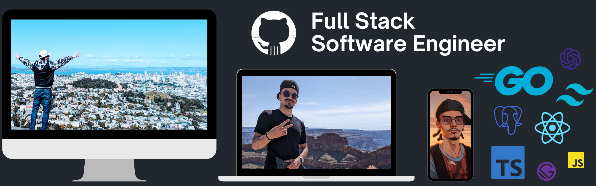

# Hello! 👋 I'm [El Walid Kadura](https://elwalidkadura.com)

🚀 Full Stack Software Engineer | 🎨 Web App Specialist | 🌌 Exploring new tech horizons

## 🌐 Get to Know Me

- 💼 Specializing in web development, adept at both frontend and backend.
- 🌍 A passionate traveler, I love exploring the world to discover breathtaking landscapes and immerse myself in diverse cultures.
- 🎨 Merging art with technology on [edub.designer](https://www.instagram.com/edub.designer/) where I showcase AI-driven artistic work on Instagram.
- 💡 Providing freelance services via [Kadura Web Services](https://kadurawebservices.com/) - Helping businesses thrive online!

- 🖥 Deeply passionate about optimizing systems and creating user-centric solutions.
- 📖 Lifelong learner, always hungry for knowledge.
## 🛠️ Tech Stack

    
    
    
    
    
    
    

    
    
    
    

    
    

    
    
    

## 📈 GitHub Stats

 

## 📫 Let's Connect

- 📧 [Email](mailto:elwalid.kadura@gmail.com)
- 🌐 [Portfolio](https://elwalidkadura.com)
- 🔗 [LinkedIn](https://www.linkedin.com/in/walid-kadura/)
- 📸 [Instagram](https://www.instagram.com/elwalid.kadura/)

🎉 Thank you for stopping by! Don't forget to star ⭐ my repositories if you find them interesting!

 

